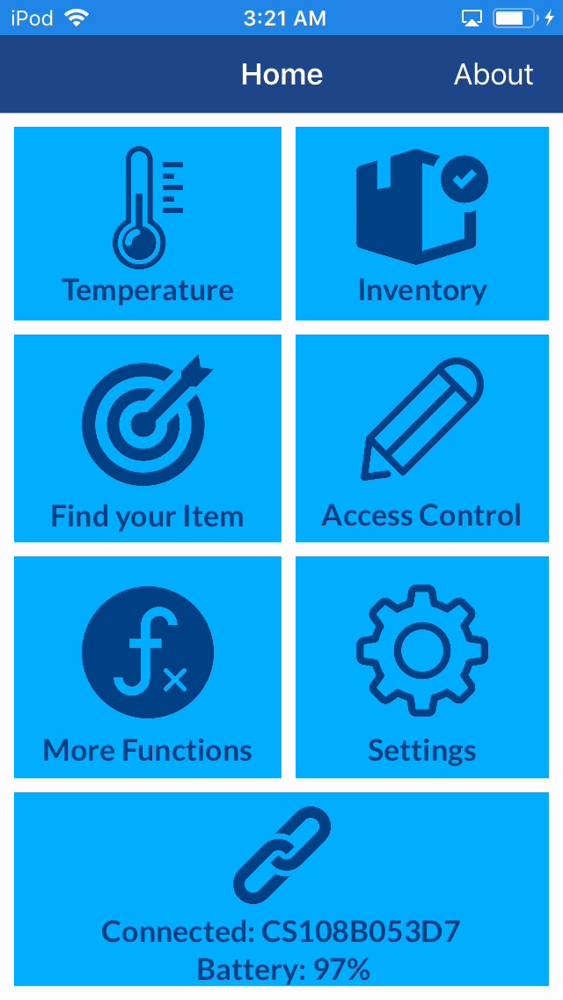
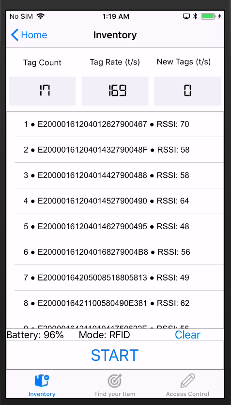
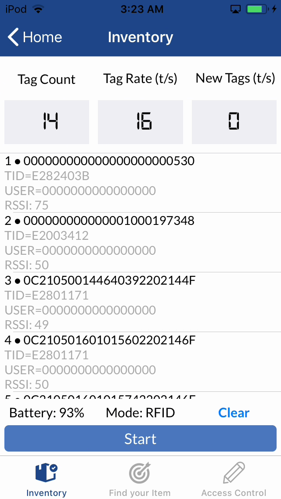

# CslCs108iOsApp

#### Library and demo app for Convergence Systems Limited CS108 UHF RFID handheld reader written in Objective-C

[Product Information](https://www.convergence.com.hk/cs108/)

[Official Downloads & Support](https://www.convergence.com.hk/downloads/cs108/)

---

---
### Development Environment
- XCode 9
- iOS 11
- Tested on iPhone 8 (optimized for 4.7" but functional on all screen sizes) 

---
**Initial version: 1.0.1 (tested against Bluetooth FW 1.0.11, RFID FW 2.6.14, SiliconLab FW 1.0.9)**

- Developed the communication and packet exchange over BLE for device discovery, connection and configurations
- Created three parallel workstreams for the basic operations: (1) Collecting notifications over the Characterister ID 9901 and put data into a buffer (2) decode the incoming notifications and packetize the data.  All packets being stored in a circular buffer (3) User application and interactions
- Prioritize the BLE interface class at the Global Central Dispatch queues so that the BLE communication is on the separate high priority queue and running on a separate thread in the background.  The UI and main program would be running on the main thread.  Tag reading to the buffer is on its own thread
- EnableTag inventory in compact mode.  
- Duplicate elimination in inventory mode.  Tested against 1000 tag read
- UI for reader selection, connection and tag inventory listing

---

**Version 1.2.412**

- Migrated the code from the application to API level for reader management, configuration and tag inventory
- New reader selection screen for improving reader selection when there are multiple readers at the scene
- Defined antenna dwell time to be zero for CS108 API
- Moved all the API calls to sync mode.  Only inventory is running async and all other call are running synchronously in the foreground
- Created new page for reader settings and configurations (power, algorithm, link profile, etc).
- Improved robustness in the process of starting/stopping inventory
- Created a new page for tag inventory
- Corrected tag read rate including unique tag rate and general tag rate.  Revised the time window (per second) so that we get a more stable number on the current read rate

---

**Version 1.3.630**

- Implemented battery level reporting
- Power configuration with a revised range
- Fixes on EPC handing and enhanced stability 
- Barcode reading functions under inventory page, with swipe to change mode
